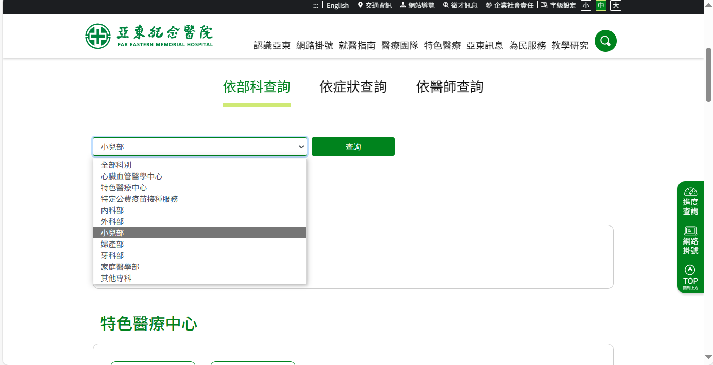
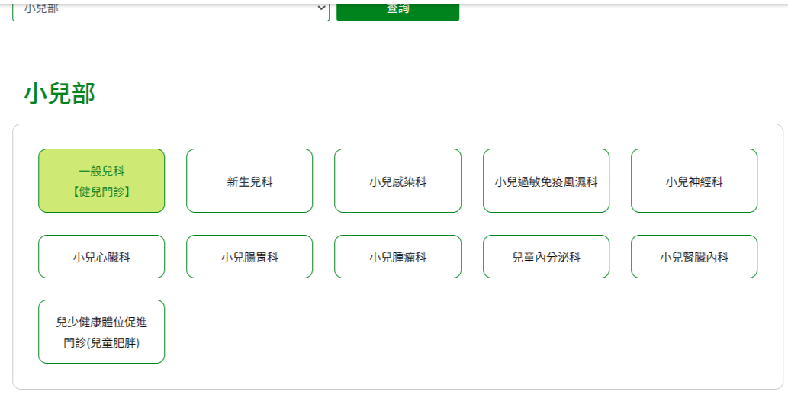
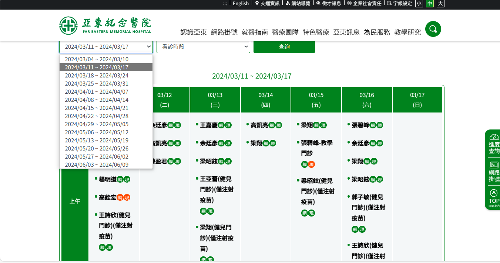
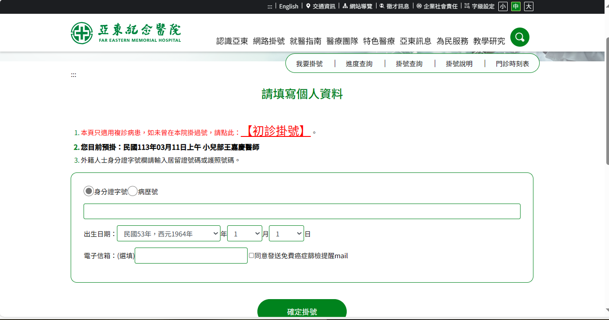

# 第2次作業-作業-HW2
>
>學號：111111104
> 
>姓名：翁永樺
> 
>作業撰寫時間：180 (mins，包含程式撰寫時間)
> 
>最後撰寫文件日期：2023/03/18
>

本份文件包含以下主題：(至少需下面兩項，若是有多者可以自行新增)
- [x] 說明內容
- [x] 個人認為完成作業須具備觀念

## 說明程式與內容
物件:部科查詢-小兒部

物件:症狀查詢-一般兒科

物件:看診時段-2024/3/11~2024/3/17

物件:資料填寫-初診掛診、身分證字號

## 個人認為完成作業須具備觀念

這次的作業學會類別和物件、UML關聯符號、UML觀念:封裝、繼承、多型;類別:虛擬的規劃」之意、屬性以及方法;物件:「實體東西」的意思。